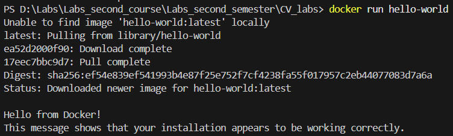
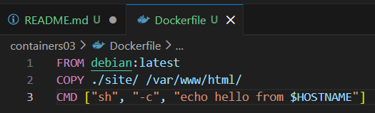
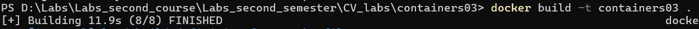
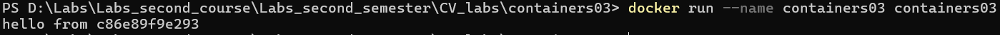
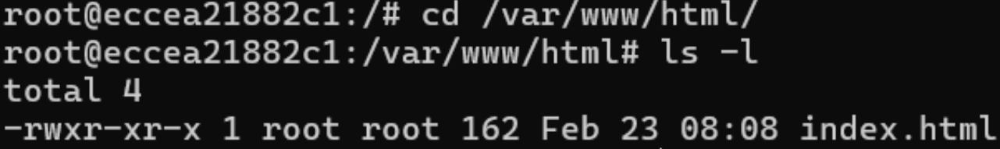

# IWNO3: Первый контейнер

**Выполнил:** Вадим Балев  
**Группа:** I2402  
**Дата выполнения:** 23.02.2026

## Цель работы

Данная лабораторная работа знакомит с основами контейнеризации и подготавливает рабочее место для выполнения следующих лабораторных работ. 

## Задание

Установить Docker Desktop и проверить его работоспособность.

## Ход работы

### Подготовка

Docker Desktop был установлен на ПК и проверен командой `Docker run hello-world`.



После этого был создан файл `Dockerfile`.



- `FROM debian:latest` - Использует последний образ Debian как базовый образ для контейнера.
- `COPY ./site/ /var/www/html/` - Копирует содержимое локальной папки ./site/ в директорию /var/www/html/ внутри контейнера.
- `CMD ["sh", "-c", "echo hello from $HOSTNAME"]` - При запуске контейнера выполняет команду, которая выводит сообщение "hello from" с именем хоста контейнера.

Затем в папке `site` был создан файл `index.html`, который содержит "Hello, world!" на HTML.

```html
<!DOCTYPE html>
<html lang="en">
<head>
    <meta charset="UTF-8">
    <title>Hello World</title>
</head>
<body>
    <b>Hello, World!</b>
</body>
</html>
```

### Запуск и тестирование

Была открыта папка проекта `containers03` в терминале и введена команда `docker build -t containers02 .`.  
Эта команда собирает Docker-образ с именем containers02, используя инструкции из файла Dockerfile, расположенного в текущей директории.

Время сборки образа:



Далее нужно было запустить контейнер, используя команду `docker run --name containers03 containers03`.



Контейнер запустился, выполнив команду `echo hello from $HOSTNAME`, где `$HOSTNAME` заменилось на уникальный идентификатор контейнера.


Следующим шагом стало выполнение следующих команд:

- `docker rm containers03` — удаляет ранее созданный контейнер с именем containers03 (если он существует), чтобы освободить имя для нового запуска.
- `docker run -ti --name containers03 containers03 bash` — создаёт и запускает новый интерактивный контейнер с именем containers03 на основе образа containers03, открывая внутри него оболочку bash для ручной работы.

Затем был запущен интерактивный контейнер на основе образа containers03. Мы перешли в директорию `/var/www/html/` и вывели список файлов.  
В результате увидели, что файл `index.html` успешно скопирован из локальной папки `./site/` при сборке образа, что подтверждает корректную работу инструкции COPY в Dockerfile.



Последним шагом стало выполнение команды `exit`, которая завершила интерактивную сессию внутри контейнера, и управление вернулось в терминал хост-системы.

## Выводы

В ходе работы был успешно настроен Docker Desktop и создан собственный образ на базе Debian, подтверждающий корректность инструкций сборки и копирования файлов. Тестирование показало, что контейнер правильно выполняет заданные команды при старте и предоставляет доступ к файловой системе для ручной проверки содержимого. Таким образом, цель лабораторной работы достигнута: среда контейнеризации развернута, а базовые принципы создания и управления образами Docker освоены на практике.

## Библиография

https://elearning.usm.md/mod/assign/view.php?id=282116&action=view  
https://www.docker.com/products/docker-desktop